#  Biotics App
A new Flutter e-learning App.

## About
I developed a fully functional e-learning application focused on biology education using Flutter. The app follows Clean Architecture and integrates Firebase services for authentication , and real-time data sync and integrates supabase for storage. It supports multi-level education from primary to secondary school.

## Features
**Authentication:** 
- Sign-in, Sign-up, Reset password, Logout, Verify email

**User Profile:** 
- Edit user information (Name, Email, Avatar)

**Lesson Content:** 
- View video lessons, flashcards, and quizzes

**Database Structure:**

- Separate databases for each teacher and their students

- Courses structured into terms, units, chapters, and lessons

**Theming & Accessibility:**

- Light/Dark mode support

- Language selection

**Performance:**

- Cached images for faster load times

## Preview
#### Splash Screen
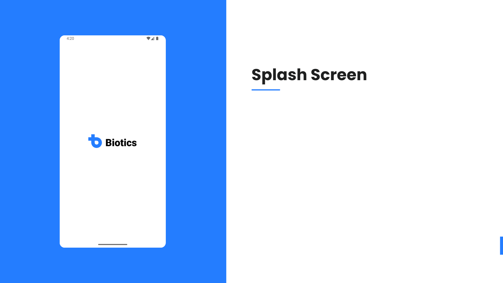
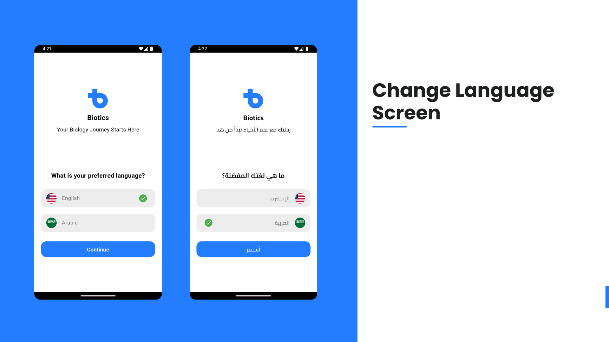
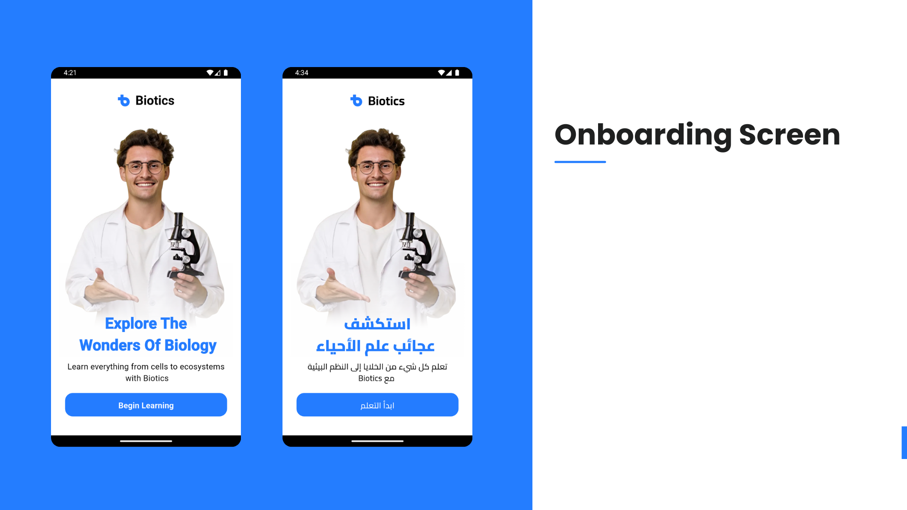
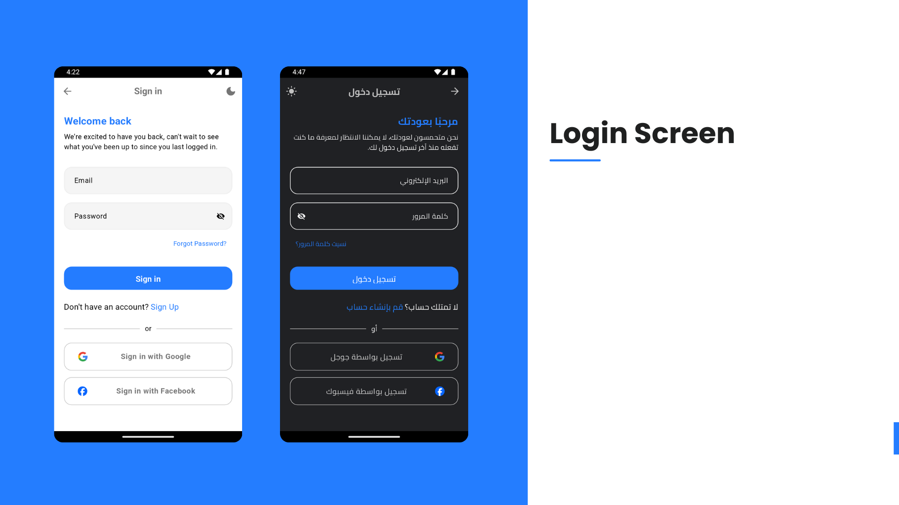
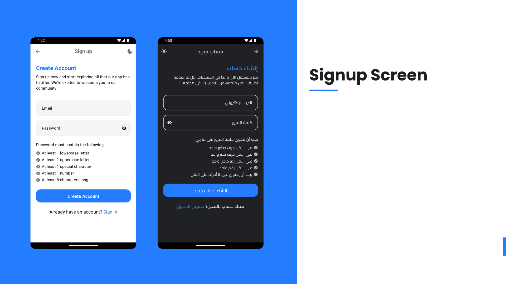
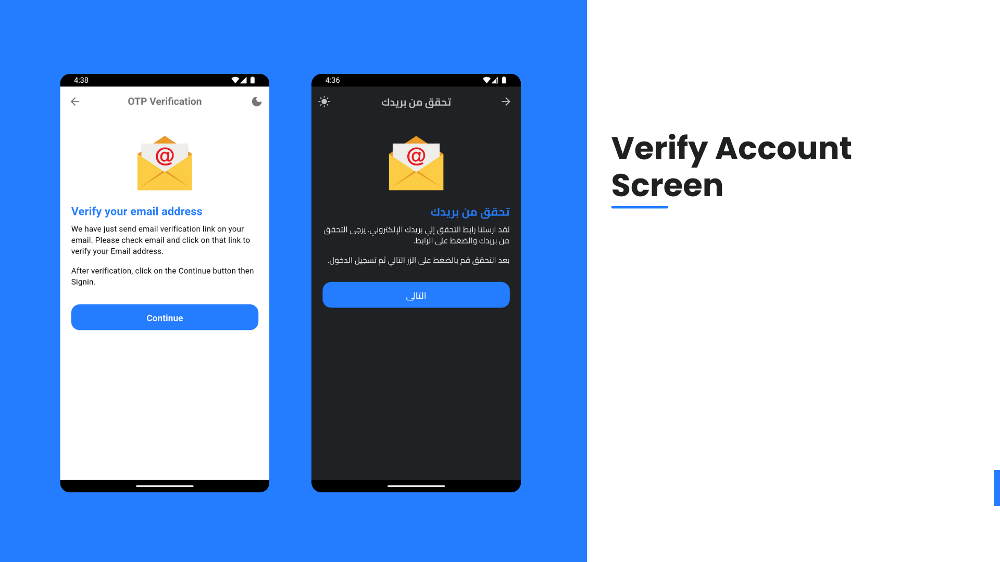
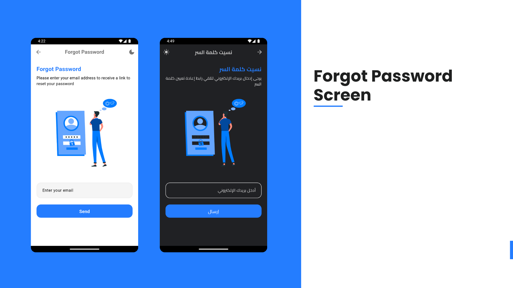
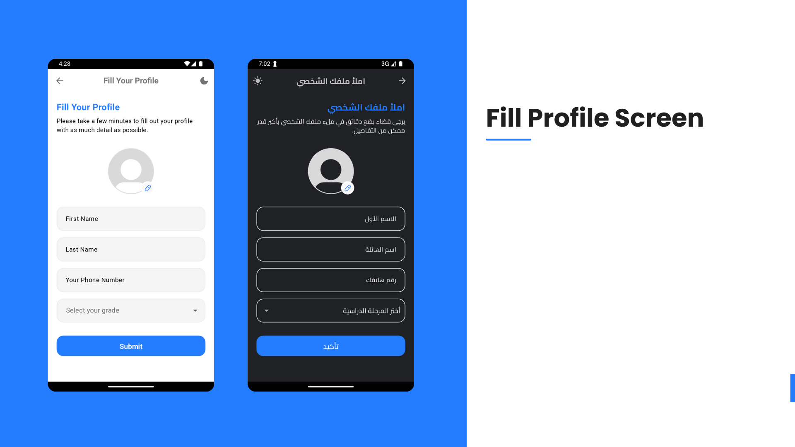
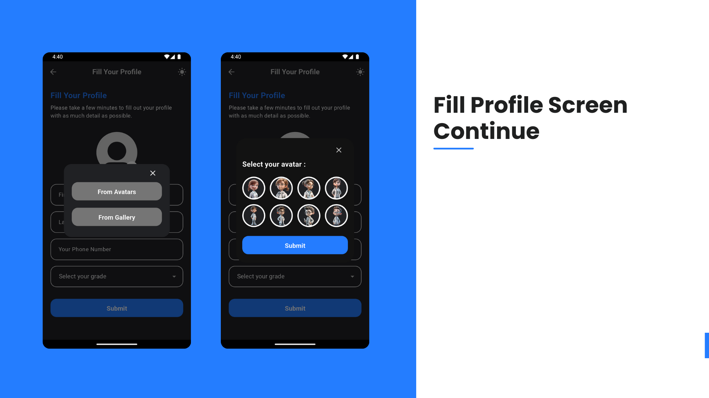
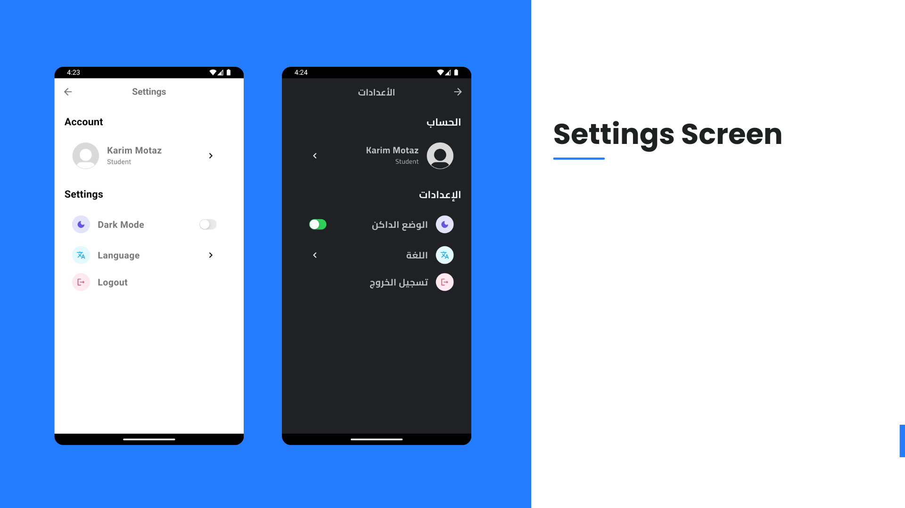
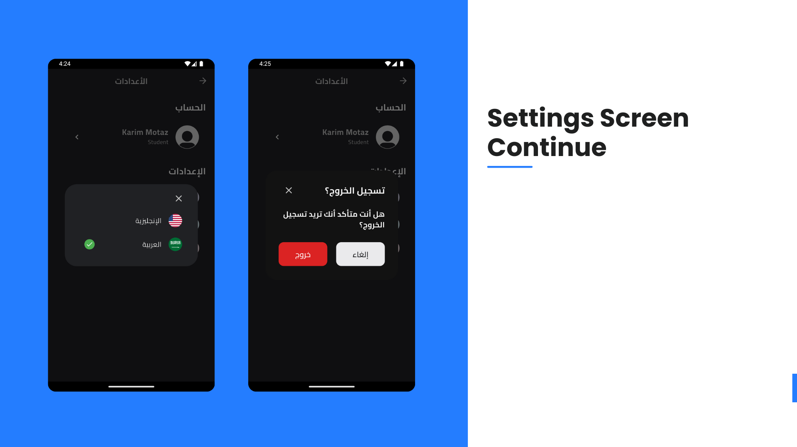
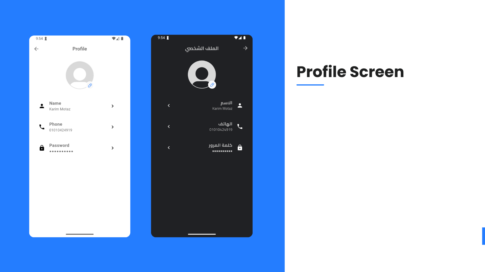
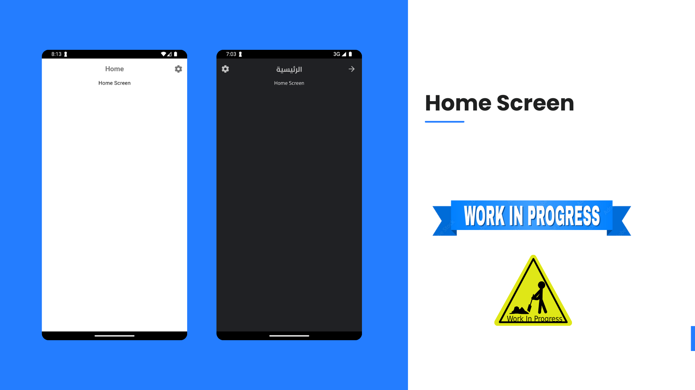

